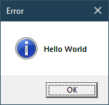
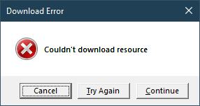
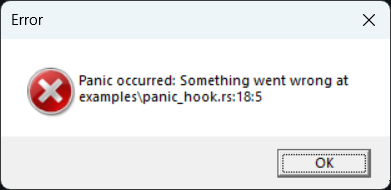

# `win-msgbox`

This crate provides a fully featured, ergonomic interface to Windows' [`MessageBox`](https://learn.microsoft.com/ewindows/win32/api/winuser/nf-winuser-messagebox).

All possible options are usable and return values are Rust enums (or structs if only one option is available).

All configuration is done through `MessageBox` and available buttons are configured via `Options`.

`message` and `title` will be converted to UTF-16 when calling `show` on the fly,
if this isn't desired, use the structs and functions exported in the `raw` module. However, note that these are
`unsafe`, as they assume the passed pointers point to valid, null-terminated UTF-16 strings.

## Examples

Show a minimal message box with an **OK** button:

```rust
use win_msgbox::Okay;
win_msgbox::show::<Okay>("Hello World");
```



Show a message box with an error icon, and match on the return value:

```rust
use win_msgbox::CancelTryAgainContinue::{self, *};

let response = win_msgbox::error::<CancelTryAgainContinue>("Couldn't download resource")
    .title("Download Error")
    .show()?;

match response {
    Cancel => println!("Cancelling downlaod..."),
    TryAgain => println!("Attempting redownload..."),
    Continue => println!("Skipping resource"),
}
```



```rust
use std::fmt::Write;

std::panic::set_hook(Box::new(|info| {
    let mut buf = String::from("Panic occurred: ");

    if let Some(msg) = info.payload_as_str() {
        buf.push_str(msg);
    } else {
        buf.push_str("(no message)");
    }
    if let Some(loc) = info.location() {
        let _ = write!(&mut buf, " at {loc}");
    }
    let _ = win_msgbox::error::<win_msgbox::Okay>(&buf).show();
}));
```



For more examples, take a look at the [`examples`](examples) directory.
