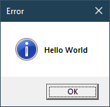

# `win-msgbox`

This crate provides a fully featured, ergonomic interface to Windows' [`MessageBox`](https://learn.microsoft.com/ewindows/win32/api/winuser/nf-winuser-messagebox).

All possible options are usable and return values are Rust enums (or structs if only one option is available).

All configuration is done through `MessageBox` and available buttons are configured via `Options`.

This crate uses wide strings. To create a wide string use the `w!` macro from [`windows`](https://docs.rs/windows/latest/windows/macro.w.html) or [`windows_sys`](https://docs.rs/windows-sys/latest/windows_sys/macro.w.html).

## Examples

Show a minimal message box with an **OK** button:

```rust
win_msgbox::show::<Okay>(w!("Hello World"));
```



Show a message box with an error icon, and match on the return value:

```rust
use CancelTryAgainContinue::*;
let response = win_msgbox::error::<CancelTryAgainContinue>(w!("Couldn't download resource"))
    .title(w!("Download Error"))
    .show()?;
match response {
    Cancel => println!("Cancelling downlaod..."),
    TryAgain => println!("Attempting redownload..."),
    Continue => println!("Skipping resource"),
}
```


For more examples, take a look at the [`examples`](examples) directory.
